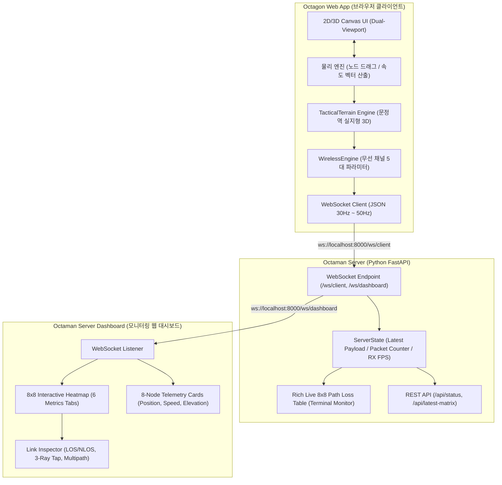
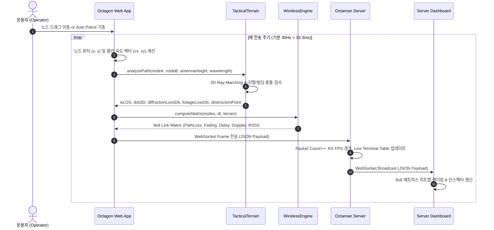

# OCTAGON & OCTAMAN 시스템 설계 및 아키텍처 사양서 (System Design Document)

> **문서 버전:** 1.1.0  
> **최종 수정일:** 2026-09-29  
> **대상 독자:** AI Agents, MANET 시뮬레이션 개발자, 전술 통신 임베디드 엔지니어  
> **프로젝트 목표:** 하드웨어(Octaman) 미구현 상태에서 8개 MANET 노드의 이동 및 실지형 기반 무선 5대 전파 파라미터(Path Loss, Fading, Delay, Multipath, Doppler)를 실시간 연산 및 브로드캐스트하는 에뮬레이션 환경 구축

---

## 1. 시스템 개요 및 구성 (System Overview)

본 시스템은 크게 3개의 핵심 컴포넌트와 1개의 테스트 검증 파이프라인으로 구성됩니다.



---

## 2. 데이터 흐름 및 시퀀스 (Data Flow & Sequence)



---

## 3. 통신 프로토콜 및 데이터 스키마 (Communication Protocol)

### 3.1 WebSocket 엔드포인트
- **클라이언트 전송:** `ws://<host>:<port>/ws/client`
- **대시보드 수신:** `ws://<host>:<port>/ws/dashboard`

### 3.2 메시지 페이로드 스키마 (`latest_payload`)

클라이언트에서 서버로 송신되는 JSON 패킷의 형식입니다:

```json
{
  "timestamp": 1727589540123,
  "scale_m": 50,
  "terrain_preset": "munjeong",
  "carrier_freq_ghz": 2.4,
  "path_loss_exp": 2.8,
  "shadowing_sigma_db": 3.0,
  "tx_power_dbm": 23.0,
  "nodes": [
    {
      "id": 1,
      "name": "N1 (Alpha)",
      "role": "문정역 거점본부 (GW)",
      "x": -15.0,
      "y": -10.0,
      "z": 24.4,
      "vx": 0.0,
      "vy": 0.0
    }
  ],
  "matrix": [
    [
      {
        "source": 1,
        "target": 2,
        "distance": 109.66,
        "distance3D": 109.68,
        "pathLoss": 142.18,
        "fading": -1.43,
        "shadowing": -1.35,
        "fastFading": -0.08,
        "delayNs": 365.85,
        "rmsDelaySpreadNs": 62.37,
        "multipath": [
          { "tap": 1, "delayNs": 0.0, "powerRatioDb": 0.0 },
          { "tap": 2, "delayNs": 35.8, "powerRatioDb": -3.5 },
          { "tap": 3, "delayNs": 95.2, "powerRatioDb": -8.5 }
        ],
        "dopplerHz": 0.0,
        "rssiDbm": -113.45,
        "linkQuality": 0,
        "isConnected": false,
        "isLOS": false,
        "diffractionLossDb": 45.0,
        "foliageLossDb": 0.0,
        "totalTerrainLossDb": 45.0,
        "elevationA": 24.4,
        "elevationB": 26.8,
        "obstructionPoint": { "x": 12.5, "y": 45.0, "z": 92.0, "penetration": 22.4, "building": "테라타워 1차" },
        "obstructingBuilding": "테라타워 1차 (Tera Tower 1, 68m)"
      }
    ]
  ]
}
```

---

## 4. 물리 및 수학적 모델링 사양 (Mathematical Physics Models)

### 4.1 3D 지형 및 광선 추적 (Ray-Marching Line-of-Sight)
- **자연 지형 고도 $z_{\text{ground}}(x, y)$:**
  $$z(x, y) = 23.0 + 0.035x + 0.008y - \Delta z_{\text{river}}(x, y) - \Delta z_{\text{valley}}(x, y) + \sum z_{\text{peak}}(x, y)$$
- **구조물 차폐 상단 $z_{\text{obs}}(x, y)$:**
  $$z_{\text{top}}(x, y) = z_{\text{ground}}(x, y) + h_{\text{building}}(x, y)$$
- **3D 광선 방정식:** 송신점 $\mathbf{P}_A = (x_1, y_1, z_1)$에서 수신점 $\mathbf{P}_B = (x_2, y_2, z_2)$까지 보간 파라미터 $t \in [0, 1]$:
  $$\mathbf{R}(t) = \mathbf{P}_A + t(\mathbf{P}_B - \mathbf{P}_A)$$
- **가시선(LOS) 판정 기준:**
  $$\text{Clearance}(t) = R_z(t) - z_{\text{top}}(R_x(t), R_y(t))$$
  - $\min_t \text{Clearance}(t) \ge 0 \implies \text{LOS (True)}$
  - $\min_t \text{Clearance}(t) < 0 \implies \text{NLOS (False)}$

### 4.2 칼날 회절 손실 (Knife-Edge Diffraction - ITU-R P.526)
광선이 지형이나 건물 상단을 관통하여 차폐(Penetration $h = - \text{Clearance} > 0$)될 경우, 무차원 프레넬-키르히호프 파라미터 $v$ 산출:
$$v = h \sqrt{\frac{2}{\lambda}\left(\frac{1}{d_1} + \frac{1}{d_2}\right)}$$
회절 추가 손실 $J(v)$ (Lee/ITU 근사식):
$$J(v) = 6.9 + 20 \log_{10} \left(\sqrt{(v - 0.1)^2 + 1} + v - 0.1\right) \quad (\text{dB})$$
(단, 하드웨어 RF 다이내믹 레인지를 고려하여 최대 $45.0\text{ dB}$로 클램핑)

### 4.3 Log-distance 3D 경로 손실 (Path Loss)
$$PL(d_{3D}) = 20 \log_{10}\left(\frac{4\pi d_0}{\lambda}\right) + 10 \cdot n \cdot \log_{10}\left(\frac{\max(d_{3D}, d_0)}{d_0}\right) + J(v) + L_{\text{foliage}} \quad (\text{dB})$$
- $d_0 = 1.0\text{ m}$, $f_c = 2.4\text{ GHz}$, $\lambda = c / f_c \approx 0.1249\text{ m}$
- $n = 2.8$ (기본 도심/복합전술환경 지수)

### 4.4 페이딩 및 시상관 섀도잉 (Correlated Shadowing & Fast Fading)
- **Gauss-Markov 시간 상관 섀도잉 프로세스:**
  $$S(t + \Delta t) = \alpha \cdot S(t) + \sqrt{1 - \alpha^2} \cdot W, \quad \alpha = \exp\left(-\frac{\Delta t}{T_{\text{decorr}}}\right)$$
  - $T_{\text{decorr}} = 1.5\text{ s}$, $W \sim \mathcal{N}(0, \sigma^2)$, $\sigma = 3.0\text{ dB}$
- **소규모 고속 페이딩 (Small-scale Fast Fading):**
  - 직접파 LOS: Rician K-factor $K = 3.0\text{ dB}$
  - 차폐 NLOS: Rayleigh 페이딩 Envelope 적용

### 4.5 다중경로 프로파일 (3-Ray Tap Model)
- **RMS 지연 확산:** $\sigma_\tau = \sigma_{\text{base}} \cdot (1 + 0.45 \log_{10}(1 + d_{3D}/10))\text{ ns}$  
  (LOS: $\sigma_{\text{base}} = 16\text{ ns}$, NLOS: $\sigma_{\text{base}} = 42\text{ ns}$)
- **Tap 1 (직접/최단 경로):** 지연 $0\text{ ns}$, $0\text{ dB}$
- **Tap 2 (지면 반사파):** 지연 $\tau_2 = \min(\tau \cdot 0.18 + \tau_{\text{bias}}, 180\text{ ns})$, 전력비 $-6.0\text{ dB}$ (LOS) / $-3.5\text{ dB}$ (NLOS)
- **Tap 3 (구조물 산란파):** 지연 $\tau_3 = \min(\tau \cdot 0.40 + \tau_{\text{bias2}}, 380\text{ ns})$, 전력비 $-14.5\text{ dB}$ (LOS) / $-8.5\text{ dB}$ (NLOS)

### 4.6 도플러 주파수 편이 (Doppler Shift)
$$\vec{v}_{\text{rel}} = \vec{v}_B - \vec{v}_A, \quad \hat{u}_{AB} = \frac{\vec{r}_B - \vec{r}_A}{\|\vec{r}_B - \vec{r}_A\|}$$
$$v_r = \vec{v}_{\text{rel}} \cdot \hat{u}_{AB} \implies f_d = \frac{v_r \cdot f_c}{c} \quad (\text{Hz})$$

---

## 5. 모듈별 구현 세부 사항 (Implementation Details)

| 파일 경로 | 주요 클래스/함수 | 핵심 역할 및 기능 |
|:---|:---|:---|
| [`static/client/terrain.js`](file:///c:/Users/megak/OneDrive/바탕%20화면/OCTAGON/static/client/terrain.js) | `TacticalTerrain` | 문정역 실지형 높이맵($z$), 탄천 수계, 도로망, 테라타워/법원/검찰청 등 8개 랜드마크 빌딩 정의, 3D Ray-Marching LOS/회절 계산, 2D 전술맵 렌더러, 3D 입체 투영 렌더러 |
| [`static/client/wireless.js`](file:///c:/Users/megak/OneDrive/바탕%20화면/OCTAGON/static/client/wireless.js) | `WirelessEngine` | 3D 거리 기반 Log-distance Path Loss, 회절/수목 손실 결합, 시간 상관 섀도잉, 3-Ray 다중경로 탭, 도플러 편이, $8\times 8$ 매트릭스 계산 |
| [`static/client/app.js`](file:///c:/Users/megak/OneDrive/바탕%20화면/OCTAGON/static/client/app.js) | `OctagonApp` | HTML5 Canvas 메인 루프, 2D/3D 듀얼 뷰포트 전환, 카메라 Orbit 회전, 8개 노드 물리 드래그 및 속도 추적, WebSocket 클라이언트 스트리밍 |
| [`server.py`](file:///c:/Users/megak/OneDrive/바탕%20화면/OCTAGON/server.py) | `FastAPI`, `ServerState` | 고성능 비동기 WebSocket 브로드캐스트 허브, Rich 라이브 콘솔 테이블(NLOS `*` 마킹), REST API 상태 제공 |
| [`static/dashboard/dashboard.js`](file:///c:/Users/megak/OneDrive/바탕%20화면/OCTAGON/static/dashboard/dashboard.js) | `DashboardMonitor` | 8x8 인터랙티브 히트맵 테이블 렌더링, 6개 탭 메트릭 전환, 링크 상세 인스펙터(차폐 원인 건물, 회절 손실, 다중경로 탭), 노드 텔레메트리 |
| [`verify_real_execution.py`](file:///c:/Users/megak/OneDrive/바탕%20화면/OCTAGON/verify_real_execution.py) | `test_real_client()` | 실제 Headless Chrome을 구동하여 WebSocket 연결, 패킷 스트림, 8x8 매트릭스, LOS/NLOS 통계, 회절 손실을 E2E로 검증하는 자동화 스크립트 |

---

## 6. 다른 AI Agent를 위한 개발 및 확장 가이드 (Extensibility Guide)

### 6.1 신규 지형 프리셋 추가 시
1. [`static/client/terrain.js`](file:///c:/Users/megak/OneDrive/바탕%20화면/OCTAGON/static/client/terrain.js)의 `loadPreset(preset)` 메소드에 신규 조건 분기 추가:
   - `this.features`: 자연 지형 피크(`peak`) 또는 능선(`ridge`) 정의
   - `this.river`: 하천 수계 포인트 배열 정의
   - `this.structures`: 신규 건물 및 벙커 3D 박스(`x, y, w, h, height, baseElev, label`) 등록
2. [`static/client/index.html`](file:///c:/Users/megak/OneDrive/바탕%20화면/OCTAGON/static/client/index.html)의 `#select-terrain-preset` 셀렉트 박스에 `<option>` 추가

### 6.2 새로운 무선 채널 파라미터 추가 시
1. [`static/client/wireless.js`](file:///c:/Users/megak/OneDrive/바탕%20화면/OCTAGON/static/client/wireless.js)의 `computeLink()` 반환 객체에 신규 필드(예: `snrDb`, `ber`, `throughputMbps`) 추가
2. [`static/dashboard/dashboard.js`](file:///c:/Users/megak/OneDrive/바탕%20화면/OCTAGON/static/dashboard/dashboard.js)의 `activeMetric` 및 `getColorForMetric()`에 히트맵 컬러 스케일 추가
3. 대시보드 HTML에 탭 버튼 추가

### 6.3 E2E 무결성 검증 실행
수정 후 반드시 다음 명령으로 실제 브라우저와 서버 간 통신 무결성을 검증하십시오:
```powershell
python verify_real_execution.py
```
- 성공 시 종료 코드 `0`과 함께 8개 노드의 3D 좌표, LOS/NLOS 회절 손실 통계가 출력됩니다.
