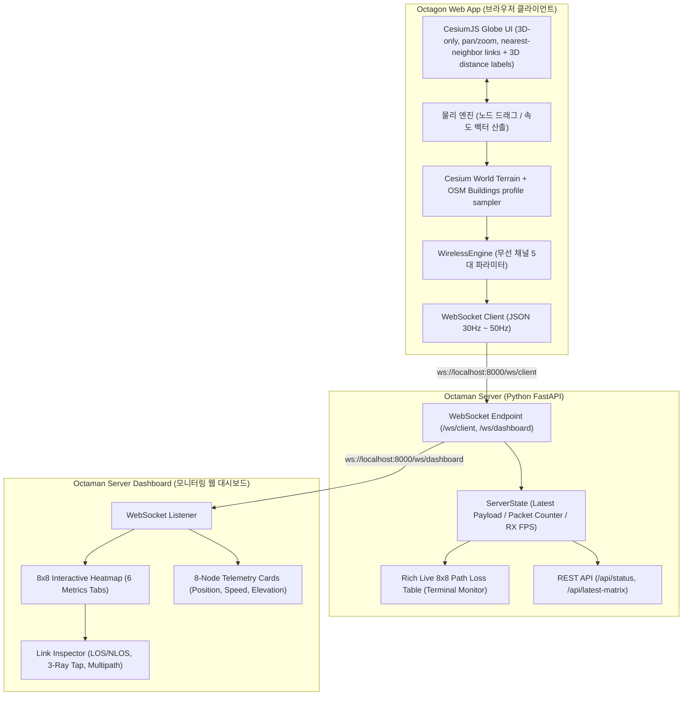
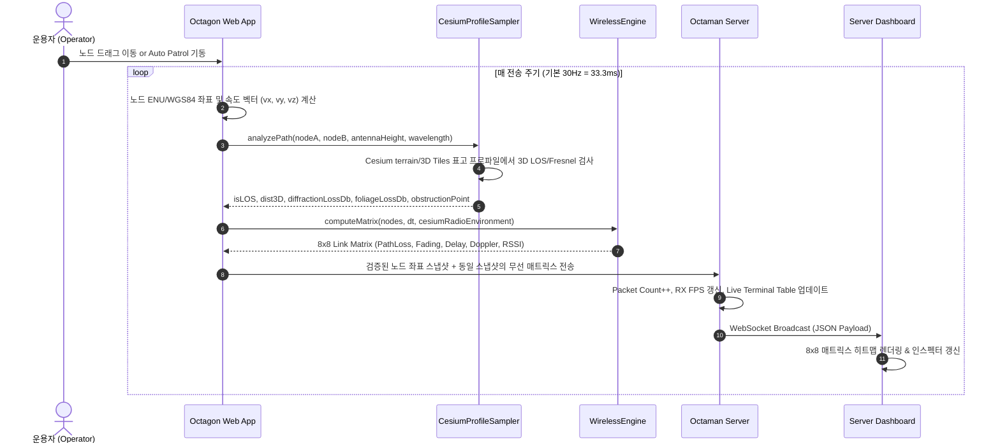

# OCTAGON & OCTAMAN 시스템 설계 및 아키텍처 사양서 (System Design Document)

> **문서 버전:** 1.2.0
> **최종 수정일:** 2026-09-29  
> **대상 독자:** AI Agents, MANET 시뮬레이션 개발자, 전술 통신 임베디드 엔지니어  
> **프로젝트 목표:** 하드웨어(Octaman) 미구현 상태에서 8개 MANET 노드의 이동 및 실지형 기반 무선 5대 전파 파라미터(Path Loss, Fading, Delay, Multipath, Doppler)를 실시간 연산 및 브로드캐스트하는 에뮬레이션 환경 구축

---

## 1. 시스템 개요 및 구성 (System Overview)

본 시스템은 크게 3개의 핵심 컴포넌트와 1개의 테스트 검증 파이프라인으로 구성됩니다.



---

## 2. 데이터 흐름 및 시퀀스 (Data Flow & Sequence)



---

## 3. 통신 프로토콜 및 데이터 스키마 (Communication Protocol)

### 3.1 WebSocket 엔드포인트
- **클라이언트 전송:** `ws://<host>:<port>/ws/client`
- **대시보드 수신:** `ws://<host>:<port>/ws/dashboard`

### 3.2 메시지 페이로드 스키마 (`latest_payload`)

클라이언트에서 서버로 송신되는 JSON 패킷의 형식입니다:

```json
{
  "timestamp": 1727589540123,
  "scale_m": 50,
  "terrain_preset": "cesium_world",
  "carrier_freq_ghz": 2.4,
  "path_loss_exp": 2.8,
  "shadowing_sigma_db": 3.0,
  "tx_power_dbm": 23.0,
  "nodes": [
    {
      "id": 1,
      "name": "N1 (Alpha)",
      "role": "문정역 거점본부 (GW)",
      "x": -15.0,
      "y": -10.0,
      "z": 24.4,
      "position_3d": { "latitude": 37.48593, "longitude": 127.12236, "altitude_m": 24.4 },
      "vx": 0.0,
      "vy": 0.0,
      "vz": 0.0
    }
  ],
  "matrix": [
    [
      {
        "source": 1,
        "target": 2,
        "distance": 109.66,
        "distance3D": 109.68,
        "pathLoss": 142.18,
        "fading": -1.43,
        "shadowing": -1.35,
        "fastFading": -0.08,
        "delayNs": 365.85,
        "rmsDelaySpreadNs": 62.37,
        "multipath": [
          { "tap": 1, "delayNs": 0.0, "powerRatioDb": 0.0 },
          { "tap": 2, "delayNs": 35.8, "powerRatioDb": -3.5 },
          { "tap": 3, "delayNs": 95.2, "powerRatioDb": -8.5 }
        ],
        "dopplerHz": 0.0,
        "rssiDbm": -113.45,
        "linkQuality": 0,
        "isConnected": false,
        "isLOS": false,
        "diffractionLossDb": 45.0,
        "foliageLossDb": 0.0,
        "totalTerrainLossDb": 45.0,
        "elevationA": 24.4,
        "elevationB": 26.8,
        "obstructionPoint": { "x": 12.5, "y": 45.0, "z": 92.0, "penetration": 22.4, "building": "테라타워 1차" },
        "obstructingBuilding": "테라타워 1차 (Tera Tower 1, 68m)"
      }
    ]
  ]
}
```

---

## 4. 물리 및 수학적 모델링 사양 (Mathematical Physics Models)

### 4.1 좌표계, 지표면 및 전술 무전기 안테나
- 지도는 CesiumJS 지구본과 Cesium ion World Terrain / OSM Buildings 3D Tiles를 사용합니다. 노드의 수평 $x,y$는 현재 배치 중심 기준 동·북 ENU 미터이며, 화면에서 노드를 놓은 위치의 실제 Cesium 지표면 높이를 샘플합니다.
- 일반적인 man-pack 무전기의 조끼/어깨 장착 안테나를 대표해 **지표면 위 1.5 m**를 기본으로 사용합니다. 실제 안테나·운용자 자세에 따라 달라지는 대표값이며 `WirelessEngine({ antennaHeightM })`로 조정합니다.
- 노드 고도는 $z_i=z_{ground,i}+1.5$ m이며 WGS84 타원체 기준 고도입니다. Cesium terrain 표고가 아직 수신되지 않으면 타원체 표고 0 m를 사용하고 실제 표고 수신 후 갱신합니다.
- 송신 직전에 노드 좌표를 하나의 스냅샷으로 정규화하고, 그 스냅샷으로 무선 매트릭스와 WGS84 좌표를 함께 만듭니다. 위도·경도·고도에 비유효 값이나 0,0 원점 좌표가 있으면 직전 정상 좌표 또는 현재 유효한 지도 중심으로 대체하며, 누락 좌표를 0.0으로 출력하지 않습니다.
- 각 링크 경로의 terrain 표고는 약 10 m 간격, 링크당 최대 64구간으로 샘플합니다. `scene.sampleHeightMostDetailed`가 지원되면 로드된 3D Tiles 표면을 terrain 위에 반영하고, terrain 표고는 `sampleTerrainMostDetailed`로 읽습니다. 표고 프로파일은 비동기로 약 0.9초 간격 갱신하며 갱신 사이에는 마지막 결과를 사용합니다.

### 4.2 3차원 거리와 경로손실
$$d_{2D}=\sqrt{(x_j-x_i)^2+(y_j-y_i)^2},\qquad d_{3D}=\sqrt{d_{2D}^2+(z_j-z_i)^2}$$
$$PL=20\log_{10}\left(\frac{4\pi d_0}{\lambda}\right)+10n\log_{10}\left(\frac{\max(d_{3D},d_0)}{d_0}\right)+L_{diff}$$
- $d_0=1$ m, $n=2.8$, $\lambda=c/f_c$ (기본 $f_c=2.4$ GHz).
- 링크의 직접선 고도 $R_z(t)=z_i+t(z_j-z_i)$를 프로파일 표면 $z_s(t)$와 비교합니다. $R_z(t)<z_s(t)$이면 NLOS로 표시합니다. 지형/건물 상단이 직접선을 가리지 않아도 제1 프레넬 반경 $F_1=\sqrt{\lambda d_1d_2/(d_1+d_2)}$의 60% 여유를 침범하면 회절 손실을 추가합니다.
- 등가 침범 높이 $h_{eff}=0.6F_1-(R_z-z_s)$와 ITU-R P.526 단일 칼날 근사로 $v=h_{eff}\sqrt{(2/\lambda)(1/d_1+1/d_2)}$, $L_{diff}=6.9+20\log_{10}(\sqrt{(v-0.1)^2+1}+v-0.1)$를 계산하고 0–45 dB로 제한합니다. 표본 자료가 없으면 표면 회절손실은 0 dB이며 거리에는 항상 안테나의 3D 고도차를 사용합니다.
- OSM Buildings 표면과 terrain 표고 차이가 2 m를 넘는 장애는 건물 차폐로 분류합니다. 수목/수관 자료는 현재 스트림에서 얻을 수 없어 $L_{foliage}=0$ dB로 둡니다.

### 4.3 페이딩, RSSI 및 링크 품질
- 쌍별 공간 상관 섀도잉: $S_{k+1}=\alpha_S S_k+\sqrt{1-\alpha_S^2}W$, $\alpha_S=e^{-\Delta s/d_{corr}}$. $\Delta s$는 두 프레임 사이 두 노드의 최대 이동거리이며, 기본 상관거리는 LOS 10 m / NLOS 13 m입니다. $W$의 표준편차는 LOS에서 설정값 $\sigma$ (기본 3 dB), NLOS에서 $1.7\sigma$입니다. 위치가 정지하면 섀도잉은 갱신되지 않습니다.
- 빠른 페이딩은 복소 채널을 $h_{k+1}=\alpha_f h_k+\sqrt{1-\alpha_f^2}w$로 갱신하는 저복잡도 상관 근사입니다. $\alpha_f=e^{-2\pi f_{D,max}\Delta t}$, $f_{D,max}=|v_{rel}|/\lambda$입니다. 속도는 연속된 무선 텔레메트리 좌표 차이로 산출하며, 좌표가 바뀌지 않으면 속도와 도플러를 0으로 처리하고 fast fading 상태를 유지합니다. 진폭 통계는 LOS Rician $K=3$ dB, NLOS $K=-40$ dB (Rayleigh 근사)입니다.
- 8×8 매트릭스는 각 무선 링크 쌍을 한 번만 계산하고, 역방향 항목은 reciprocal 값과 반대 부호의 도플러를 기록합니다.
- 수신전력: $P_r=P_t+G_t+G_r-PL-(S+F_{fast})$. 기본 $P_t=23$ dBm, $G_t=G_r=2.15$ dBi.
- 링크 품질은 RSSI -98 dBm을 0%, -58 dBm을 100%로 선형 변환하고 0–100%로 제한합니다. -98 dBm 이상을 연결 가능으로 표시합니다.

### 4.4 전파 지연 및 3-Ray 프로파일
- 직접파 지연은 $\tau_{LOS}=d_{3D}/c$입니다. `delayNs`는 절대 전파 지연이며 탭 지연은 직접파 기준 초과 지연입니다.
- 탭 1은 직접파 기준 0 ns / 0 dB입니다. 지면 반사 탭 2는 이미지 기하 $d_g=\sqrt{d_{2D}^2+(h_i+h_j)^2}$에서 $\tau_2=\max(0,(d_g-d_{3D})/c)$를 계산하고 상대 전력은 LOS/NLOS에서 -6/-3.5 dB입니다.
- 탭 3은 지형/건물의 주 차폐점까지의 3D 두 구간 길이와 직접 경로의 차이로 초과 지연을 산출합니다. 차폐점이 없으면 직접 3D 거리의 1.03배(LOS) / 1.12배(NLOS)를 산란 경로 길이 근사로 씁니다. 상대 전력은 -14.5/-8.5 dB입니다.
- RMS 지연 확산은 세 탭 지연의 상대전력을 선형 스케일로 바꾼 가중 표준편차입니다. 따라서 거리, 지면 반사 안테나 높이, 샘플된 차폐점, LOS 상태가 반영됩니다.

### 4.5 3차원 도플러
$$\hat{u}_{ij}=\frac{(x_j-x_i,y_j-y_i,z_j-z_i)}{d_{3D}},\qquad v_r=(\vec v_j-\vec v_i)\cdot\hat{u}_{ij},\qquad f_d=\frac{v_rf_c}{c}$$
노드 속도 $(v_x,v_y,v_z)$의 3축 성분을 모두 사용합니다. Auto Patrol은 각 노드별로 0.2–1.5 m/s 속도와 방향을 독립 무작위 선택하며 약 0.9–3초마다 방향을 갱신합니다. 노드는 현재 지도 중심 주변의 축척 비례 이동 영역에 머뭅니다. 노드 드래그는 지표면 표고 변화로 $v_z$를 산출하고 정지 노드의 $v_z$는 0입니다.

> 건물/지형 프로파일은 Cesium ion 토큰, 데이터 로딩 및 현재 뷰/타일 가용성에 의존합니다. 타일이 제공되지 않는 링크는 3D 거리·고도 기반 계산은 계속하지만 LOS를 막는 표면이나 회절손실은 추정하지 않습니다. 수관 데이터가 없으므로 수목 감쇠는 계산하지 않습니다.

---

## 5. 모듈별 구현 세부 사항 (Implementation Details)

| 파일 경로 | 주요 클래스/함수 | 핵심 역할 및 기능 |
|:---|:---|:---|
| [`static/client/wireless.js`](file:///c:/Users/megak/OneDrive/바탕%20화면/OCTAGON/static/client/wireless.js) | `WirelessEngine` | 3D 거리 기반 Log-distance Path Loss, 회절/수목 손실 결합, 시간 상관 섀도잉, 3-Ray 다중경로 탭, 도플러 편이, $8\times 8$ 매트릭스 계산 |
| [`static/client/app.js`](file:///c:/Users/megak/OneDrive/바탕%20화면/OCTAGON/static/client/app.js) | `OctagonApp` | Cesium 단일 지도, 최인접 노드 연결선·3D 거리 레이블, 지형 프로파일 샘플링, 축척 기반 포메이션·무작위 분산 및 Auto Patrol, 지표면 위 안테나 배치, 3D 좌표·속도 추적, WebSocket 스트리밍 |
| [`server.py`](file:///c:/Users/megak/OneDrive/바탕%20화면/OCTAGON/server.py) | `FastAPI`, `ServerState` | 고성능 비동기 WebSocket 브로드캐스트 허브, Rich 라이브 콘솔 테이블(NLOS `*` 마킹), REST API 상태 제공 |
| [`static/dashboard/dashboard.js`](file:///c:/Users/megak/OneDrive/바탕%20화면/OCTAGON/static/dashboard/dashboard.js) | `DashboardMonitor` | 8x8 인터랙티브 히트맵 테이블 렌더링, 6개 탭 메트릭 전환, 링크 상세 인스펙터(차폐 원인 건물, 회절 손실, 다중경로 탭), 노드 텔레메트리 |
| [`verify_real_execution.py`](file:///c:/Users/megak/OneDrive/바탕%20화면/OCTAGON/verify_real_execution.py) | `test_real_client()` | 실제 Headless Chrome을 구동하여 WebSocket 연결, 패킷 스트림, 8x8 매트릭스, LOS/NLOS 통계, 회절 손실을 E2E로 검증하는 자동화 스크립트 |

---

## 6. 다른 AI Agent를 위한 개발 및 확장 가이드 (Extensibility Guide)

### 6.1 지도 위치 추가 시
1. `static/client/app.js`의 `MAP_LOCATIONS`에 표시 이름과 WGS84 위도·경도, 시작 카메라 고도를 추가합니다.
2. `static/client/index.html`의 `#select-map-location`에 대응하는 `<option>`을 추가합니다. 지형과 건물은 Cesium ion 스트림에서 불러옵니다.

### 6.2 새로운 무선 채널 파라미터 추가 시
1. [`static/client/wireless.js`](file:///c:/Users/megak/OneDrive/바탕%20화면/OCTAGON/static/client/wireless.js)의 `computeLink()` 반환 객체에 신규 필드(예: `snrDb`, `ber`, `throughputMbps`) 추가
2. [`static/dashboard/dashboard.js`](file:///c:/Users/megak/OneDrive/바탕%20화면/OCTAGON/static/dashboard/dashboard.js)의 `activeMetric` 및 `getColorForMetric()`에 히트맵 컬러 스케일 추가
3. 대시보드 HTML에 탭 버튼 추가

### 6.3 E2E 무결성 검증 실행
수정 후 반드시 다음 명령으로 실제 브라우저와 서버 간 통신 무결성을 검증하십시오:
```powershell
python verify_real_execution.py
```
- 성공 시 종료 코드 `0`과 함께 8개 노드의 3D 좌표, LOS/NLOS 회절 손실 통계가 출력됩니다.
